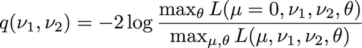
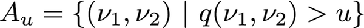
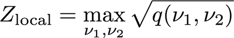
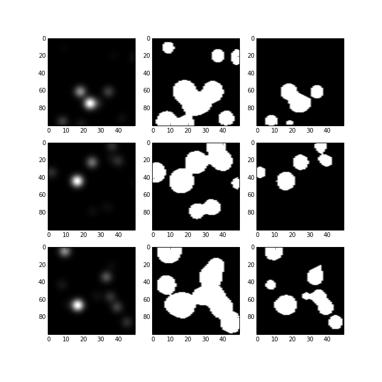

## Look Elsewhere Effect in 2-d

Kyle Cranmer, Nov 19, 2015

Based on
*Estimating the significance of a signal in a multi-dimensional search* by  Ofer Vitells and Eilam Gross http://arxiv.org/pdf/1105.4355v1.pdf

**Note**: You can run the notebook from your browser right now by gong to [everware](https://everware.rep.school.yandex.net/) and paste the URL to this repository. 

[](http://dx.doi.org/10.5281/zenodo.34842)

```
@misc{kyle_cranmer_2015_34842,
  author       = {Kyle Cranmer},
  title        = {look-elsewhere-2d: v1.0},
  month        = dec,
  year         = 2015,
  doi          = {10.5281/zenodo.34842},
  url          = {http://dx.doi.org/10.5281/zenodo.34842}
}
```

## Usage:

```python
import lee2d
```

You start with several 2d numpy arrays that represent the 



It's up to you to threshold on that scan to make 2d numpy arrays for
the excursion sets 



This shoudl be done at two different threshold levels $u_1$ and $u_2$ giving new numpy
arrays with values 0. or 1. For example

```python
	q_scan = np.array((nx, ny))

    #get excursion sets above those two levels
    A_u1 = (q_scan>u1) + 0. #add 0. to convert from bool to double
    A_u2 = (q_scan>u2) + 0.
```

For each of these scans you calculate the Euler characteristic 
using this function in `lee2d.py`

```python
def calculate_euler_characteristic(a):
   """Calculate the Euler characteristic for level set a"""
```

after calculating the expected (mean) value of the Euler characteristics
for those two different levels, you can correct the local siginficance with
this function in `lee2d.py`. The maximum local significance is given by 



```python
def do_LEE_correction(max_local_sig, u1, u2, exp_phi_1, exp_phi_2):
   """
   Return the global p-value for an observed local significance 
   after correcting for the look-elsewhere effect
   given expected Euler characteristic exp_phi_1 above level u1
   and exp_phi_2 above level u2
   """
```

These are toy histograms, but they are supposed to represent scans of $ q(\nu_1, nu_2)$ where

\begin{equation}
q(\nu_1, \nu_2) = -2 \log \frac{ \max_\theta L(\mu=0, \nu_1, \nu_2, \theta)}{ \max_{\mu, \theta} L(\mu, \nu_1, \nu_2, \theta)}
\end{equation}

and $\theta$ are nuisance parameters for the background model, $\mu$ is parameter of interest, and $\nu_1, \nu_2$ are nuisance parameters for the signal that are not meaningful for the null (eg. the mass and width of a hypothetical particle).

In this setting, the maximum local significance is given by 

\begin{equation}
Z_{local} = \max_{\nu_1, \nu_2} \sqrt{q(\nu_1, \nu_2)}
\end{equation}


## Examples

See [an example using ROOT histograms](https://github.com/cranmer/look-elsewhere-2d/blob/master/root_TH2F_example.ipynb)

**Note**: You can run the notebook from your browser right now by gong to [everware](https://everware.rep.school.yandex.net/) and paste the URL to this repository. 


## Background

This is for the special case of a likelihood function of the form 
$L(\mu, \nu_1, \nu_2)$ where $\mu$ is a single parameter of interest and
$\nu_1,\nu_2$ are two nuisance parameters that are not identified under the null.
For example, $\mu$ is the signal strength of a new particle and $\nu_1,\nu_2$ are the
unknown mass and width of the new particle. Under the null hypothesis, those parameters 
don't mean anything... aka they "are not identified under the null" in the statistics jargon.
This introduces a 2-d look elsewhere effect.

The LEE correction in this case is based on 

\begin{equation}
E[ \phi(A_u) ] = P(\chi^2_1 > u) + e^{-u/2} (N_1 + \sqrt{u} N_2) \,
\end{equation}
where 
   * $A_u$ is the 'excursion set above level $u$ (eg. the set of parameter points in $(\nu_1,\nu_2)$ that have a -2 log-likelihood ratio greater than $u$ )
   * $\phi(A_u)$ is the Euler characteristic of the excursion set
   * $E[ \phi(A_u) ]$ is the expectation of the Euler characteristic of those excursion sets under the null
   * $P(\chi^2_1 > u)$ is the standard chi-square probability 
   * and $N_1$ and $N_2$ are two coefficients that characterize the chi-square random field.
   
### Image of example 2-d likelihood scans
  

